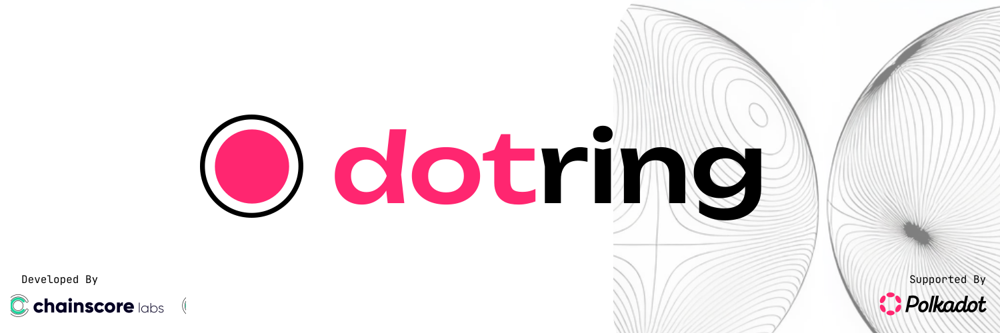

[](https://github.com/Chainscore/dot-ring/actions/workflows/test.yml)
[](https://codecov.io/gh/Chainscore/dot-ring)
[](https://www.python.org/downloads/)
[](LICENSE)
[](https://github.com/psf/black)

`@dot-ring` is a Python library for generating Verifiable Random Functions with Additional Data (VRF-AD) on 10+ Elliptic Curves, including IETF, Pedersen VRF and Ring Proof.


Specifications in compliance: 
- [Bandersnatch VRF](https://github.com/davxy/bandersnatch-vrf-spec/blob/main/specification.md) 
- [Ring Proof](https://github.com/davxy/ring-proof-spec)
- [RFC9381](https://datatracker.ietf.org/doc/rfc9381)
- [RFC9380](https://datatracker.ietf.org/doc/rfc9380)
- [BCGSV23](https://eprint.iacr.org/2023/002)
- [MSZ21](https://eprint.iacr.org/2021/1152)
---

## Installation & Setup

### Prerequisites
- Python 3.12 or higher
- [uv](https://github.com/astral-sh/uv) (Recommended for dependency management)

### Installation using uv (Recommended)

1.  **Install uv** (if not already installed):
    ```bash
    curl -LsSf https://astral.sh/uv/install.sh | sh
    ```

2.  **Clone the repository**:
    ```bash
    git clone https://github.com/chainscore/dot-ring.git
    cd dot-ring
    ```

3.  **Run the setup script**:
    This script installs all dependencies, builds `blst` bindings, and compiles Cython extensions.
    ```bash
    ./setup.sh
    ```

### Manual Installation

If you prefer not to use `uv` or the setup script, you can install using pip:

```bash
pip install .
# For development dependencies
pip install .[dev]
```

To install `blst` manually:
```bash
git clone https://github.com/supranational/blst.git .blst
cd .blst/bindings/python
./run.me
# Then ensure the generated blst.py and shared library are in your PYTHONPATH or site-packages
export PYTHONPATH=YOUR_PATH_HERE/blst/bindings/python:$PYTHONPATH
```

## Example Usage
```python
# Sample test vector
secret_key="3d6406500d4009fdf2604546093665911e753f2213570a29521fd88bc30ede18"
alpha=""
salt=""
add=""
ring_pks="7b32d917d5aa771d493c47b0e096886827cd056c82dbdba19e60baa8b2c60313d3b1bdb321123449c6e89d310bc6b7f654315eb471c84778353ce08b951ad471561fdb0dcfb8bd443718b942f82fe717238cbcf8d12b8d22861c8a09a984a3c5a1b1da71cc4682e159b7da23050d8b6261eb11a3247c89b07ef56ccd002fd38b4fd11f89c2a1aaefe856bb1c5d4a1fad73f4de5e41804ca2c17ba26d6e10050c86d06ee2c70da6cf2da2a828d8a9d8ef755ad6e580e838359a10accb086ae437ad6fdeda0dde0a57c51d3226b87e3795e6474393772da46101fd597fbd456c1b3f9dc0c4f67f207974123830c2d66988fb3fb44becbbba5a64143f376edc51d9"
```
### For IETF VRF
```python
from dot_ring.curve.specs.bandersnatch import Bandersnatch
from dot_ring.vrf.ietf.ietf import IETF_VRF

# Generate Proof
proof: IETF_VRF = IETF_VRF[Bandersnatch].proof(alpha, secret_key, add)
# Or from bytes
proof_bytes = proof.to_bytes()
proof: IETF_VRF = IETF_VRF[Bandersnatch].from_bytes(proof_bytes)

# Verify Proof
public_key = IETF_VRF[Bandersnatch].get_public_key(secret_key)
is_valid: bool = proof.verify(public_key, alpha, add)
```

### For Pedersen VRF
```python
from dot_ring.curve.specs.bandersnatch import Bandersnatch
from dot_ring.vrf.pedersen.pedersen import PedersenVRF

# Generate Proof
proof: PedersenVRF = PedersenVRF[Bandersnatch].proof(alpha, secret_key, add)
# Or import from bytes
proof_bytes = proof.to_bytes()
proof: PedersenVRF = PedersenVRF[Bandersnatch].from_bytes(proof_bytes)

# Verify Proof
# Public key is blinded in Pedersen VRF and included in the proof
is_valid: bool = proof.verify(alpha, add)
```

### For Ring VRF
```python
from dot_ring.curve.specs.bandersnatch import Bandersnatch
from dot_ring.vrf.ring.ring_vrf import RingVRF

# Parse keys if they are in a single byte string
keys_list = RingVRF[Bandersnatch].parse_keys(ring_pks)

# Generate ring root commitment
ring_root = RingVRF[Bandersnatch].construct_ring_root(keys_list)

# Generate Ring VRF proof
# producer_key is the public key corresponding to secret_key
producer_key = RingVRF[Bandersnatch].get_public_key(secret_key)
proof: RingVRF = RingVRF[Bandersnatch].proof(alpha, add, secret_key, producer_key, keys_list)
# Or from bytes
proof_bytes = proof.to_bytes() # 768 bytes ring proof
proof: RingVRF = RingVRF[Bandersnatch].from_bytes(proof_bytes)
# Verify Ring VRF Proof
is_valid: bool = proof.verify(alpha, add, ring_root)
```


## Testing

You can run the test suite with **pytest** using `uv`:

```bash
uv run pytest tests/
```
See [TESTING.md](./TESTING.md) for an overview of the test suite and instructions on running tests.


## Docker Setup

### Build the Docker Image
```bash
docker build -t dot_ring .
```

### Run tests inside a container
```bash
docker run -it dot_ring uv run pytest tests/
```

### Generate a Coverage report
- Terminal summary
```bash
docker run -it dot_ring uv run pytest tests/ --cov=dot_ring --cov-report=term-missing
```

- HTML report
```bash
docker run -it dot_ring uv run pytest tests/ --cov=dot_ring --cov-report=html
open htmlcov/index.html #open it in your browser
``` 
Access an interactive shell inside the container
```bash
docker run -it dot_ring bash
```

## Contact

Prasad // Chainscore Labs


[Email](mailto:prasad@chainscore.finance)

[Website](https://chainscore.finance)